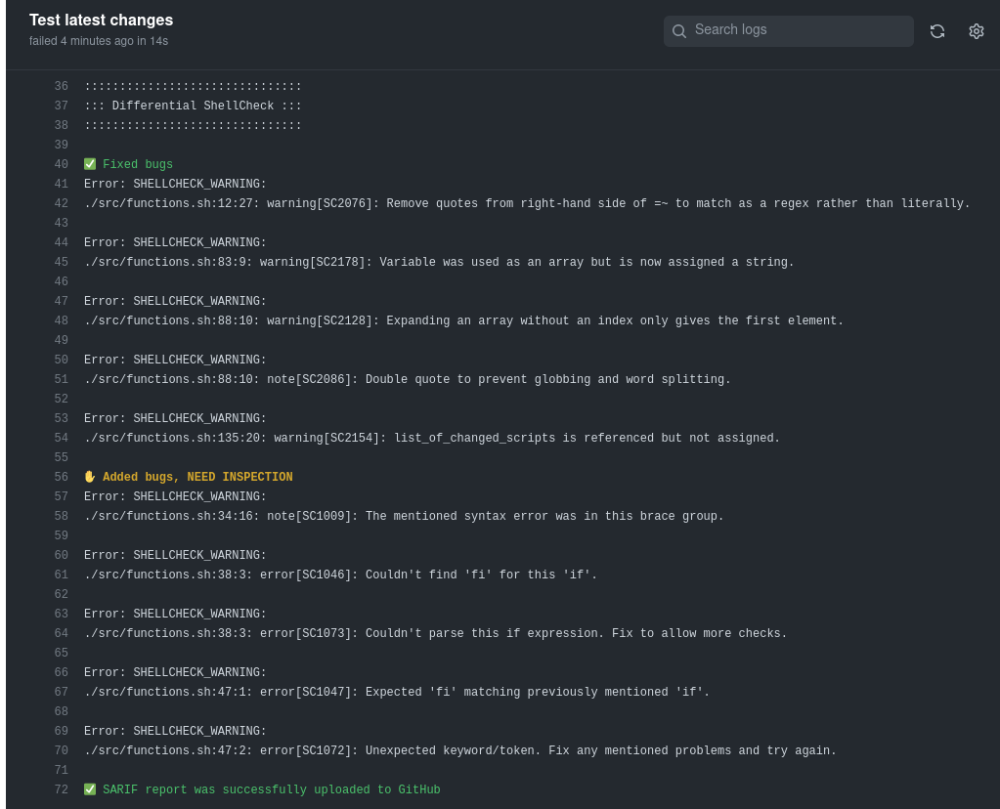

<!-- markdownlint-disable MD033 MD041 -->
<p align="center">
  
  <h1 align="center">Differential ShellCheck</h1>
</p>

[![GitHub Marketplace][market-status]][market] [![Lint Code Base][linter-status]][linter] [![Unit Tests][test-status]][test] [](https://codecov.io/gh/redhat-plumbers-in-action/differential-shellcheck) [![Mergify Status][mergify-status]][mergify]

<!-- Status links -->

[market]: https://github.com/marketplace/actions/differential-shellcheck
[market-status]: https://img.shields.io/badge/Marketplace-Differential%20Shellcheck-blue.svg?colorA=24292e&colorB=0366d6&style=flat&longCache=true&logo=data:image/png;base64,iVBORw0KGgoAAAANSUhEUgAAAA4AAAAOCAYAAAAfSC3RAAAABHNCSVQICAgIfAhkiAAAAAlwSFlzAAAM6wAADOsB5dZE0gAAABl0RVh0U29mdHdhcmUAd3d3Lmlua3NjYXBlLm9yZ5vuPBoAAAERSURBVCiRhZG/SsMxFEZPfsVJ61jbxaF0cRQRcRJ9hlYn30IHN/+9iquDCOIsblIrOjqKgy5aKoJQj4O3EEtbPwhJbr6Te28CmdSKeqzeqr0YbfVIrTBKakvtOl5dtTkK+v4HfA9PEyBFCY9AGVgCBLaBp1jPAyfAJ/AAdIEG0dNAiyP7+K1qIfMdonZic6+WJoBJvQlvuwDqcXadUuqPA1NKAlexbRTAIMvMOCjTbMwl1LtI/6KWJ5Q6rT6Ht1MA58AX8Apcqqt5r2qhrgAXQC3CZ6i1+KMd9TRu3MvA3aH/fFPnBodb6oe6HM8+lYHrGdRXW8M9bMZtPXUji69lmf5Cmamq7quNLFZXD9Rq7v0Bpc1o/tp0fisAAAAASUVORK5CYII=

[linter]: https://github.com/redhat-plumbers-in-action/differential-shellcheck/actions/workflows/linter.yml
[linter-status]: https://github.com/redhat-plumbers-in-action/differential-shellcheck/actions/workflows/linter.yml/badge.svg

[test]: https://github.com/redhat-plumbers-in-action/differential-shellcheck/actions/workflows/unit-test.yml
[test-status]: https://github.com/redhat-plumbers-in-action/differential-shellcheck/actions/workflows/unit-test.yml/badge.svg

[mergify]: https://mergify.com
[mergify-status]: https://img.shields.io/endpoint.svg?url=https://api.mergify.com/v1/badges/redhat-plumbers-in-action/differential-shellcheck&style=flat

<!-- -->

This repository hosts code for running differential ShellCheck in GitHub actions. Idea of having something like a differential ShellCheck was first introduced in [@fedora-sysv/initscripts](https://github.com/fedora-sysv/initscripts). Initscripts needed some way to verify incoming PRs without getting warnings and errors about already merged and for years working code. Therefore, differential ShellCheck was born.

## How does it work

First Differential ShellCheck gets a list of changed shell scripts based on file extensions, shebangs and script list, if provided. Then it calls [@koalaman/shellcheck](https://github.com/koalaman/shellcheck) on those scripts where it stores ShellCheck output for later use. Then it switches from `HEAD` to provided `BASE` and runs ShellCheck on the same files as before and stores output to a separate file.

To evaluate results, Differential ShellCheck uses utilities `csdiff` and `csgrep` from [@csutils/csdiff](https://github.com/csutils/csdiff). First `csdiff` is used to get a list/number of fixed and added errors. And then `csgrep` is used to output the results in a nice colorized way to console and optionally into GitHub GUI as a security alert.

## Features

* Shell scripts auto-detection based on shebangs, shellcheck directives and file extensions
  * supported shell interpreters are: `sh`, `ash`, `bash`, `dash`, `ksh` and `bats`
  * supported shebangs are: `#!/bin/`, `#!/usr/bin/`, `#!/usr/local/bin/`, `#!/bin/env␣`, `#!/usr/bin/env␣` and `#!/usr/local/bin/env␣` ; e.g. `#!/bin/env␣bash`
* Ability to allowlist specific error codes
* Statistics about fixed and added errors
* Colored console output with emojis
* [SARIF support](https://docs.github.com/en/code-security/code-scanning/integrating-with-code-scanning/sarif-support-for-code-scanning) - warnings are visible in the `Changed files` tab of the Pull-Request
* Ability to run in a verbose mode when run with [debug option](https://github.blog/changelog/2022-05-24-github-actions-re-run-jobs-with-debug-logging/)
* Results displayed as [job summaries](https://github.blog/2022-05-09-supercharging-github-actions-with-job-summaries/)

## Usage

Example of running Differential ShellCheck:

```yml
name: Differential ShellCheck
on:
  pull_request:
    branches: [main]

permissions:
  contents: read

jobs:
  test:
    runs-on: ubuntu-latest

    permissions:
      security-events: write
      pull-requests: write

    steps: 
      - name: Repository checkout
        uses: actions/checkout@v3
        with:
          fetch-depth: 0

      - name: Differential ShellCheck
        uses: redhat-plumbers-in-action/differential-shellcheck@latest
        with:
          token: ${{ secrets.GITHUB_TOKEN }}
```

> **Note**: _`fetch-depth: 0` is required in order to run `differential-shellcheck` successfully._

<details>
  <summary>Console output example</summary>
  <p align="center">
    
  </p>
</details>

<details>
  <summary>Example of output in Changed files tab</summary>
  <p align="center">
    
    
  </p>
</details>

<details>
  <summary>Example of @github-code-scanning bot review comment</summary>
  <p align="center">
    
    
  </p>
</details>

### Real life examples of usage

* [`fedora-sysv/initscripts`](https://sourcegraph.com/search?q=context:global+repo:%5Egithub%5C.com/fedora-sysv/initscripts%24+file:%5E%5C.github/workflows+redhat-plumbers-in-action/differential-shellcheck&patternType=literal) [](https://github.com/fedora-sysv/initscripts)

## Configuration options

Action currently accepts following options:

```yml
# ...

- name: Differential ShellCheck
  uses: redhat-plumbers-in-action/differential-shellcheck@latest
  with:
    base: <base-sha>
    head: <head-sha>
    ignored-codes: <path to file with list of codes>    # <-- Deprecated option
    shell-scripts: <path to file with list of scripts>
    external-sources: <true or false>
    severity: <minimal severity level>
    token: <GitHub token>

# ...
```

### base

`SHA` of commit which will be used as the base when performing differential ShellCheck.

* default value: `github.event.pull_request.base.sha`
* requirements: `optional`

### head

`SHA` of commit which refers to `HEAD`.

* default value: `github.event.pull_request.head.sha`
* requirements: `optional`

### ignored-codes

Path to a text file which holds a list of ShellCheck codes which should be excluded from validation.

* default value: `undefined`
* requirements: `optional`

> **Note**: _This option is now deprecated, please consider using `.shellcheckrc` instead._

### shell-scripts

Path to a text file which holds a list of shell scripts which would not, otherwise, be automatically picked by the shell script auto-detection routine.

* default value: `undefined`
* requirements: `optional`
* example: [.differential-shellcheck-scripts.txt](.github/.differential-shellcheck-scripts.txt)

> **Note**: _Every path should be absolute and placed on a separate line. Avoid spaces in the list since they are interpreted as comments._

### external-sources

Enable following of source statements even when the file is not specified as input. By default, [ShellCheck](https://github.com/koalaman/shellcheck/blob/master/shellcheck.1.md) will only follow files specified on the command line (plus `/dev/null`). This option allows following any file the script may source. This option may also be enabled using `external-sources=true` in `.shellcheckrc`.

* default value: `true`
* requirements: `optional`

### severity

Minimal severity level of detected errors that will be reported. Valid values in order of severity are `error`, `warning`, `info` and `style`.

* default value: `style`
* requirements: `optional`

### token

Token used to upload findings in SARIF format to GitHub.

* default value: `undefined`
* requirements: `optional`

Token needs to have the following [characteristics](https://docs.github.com/en/rest/code-scanning#upload-an-analysis-as-sarif-data):

* Token with the `security_events` scope to use this endpoint for private repositories.
* Token with the `public_repo` scope for **public repositories only**.

## Limitations

* Currently `differential-shellcheck` action can be run only on Pull-Requests.
