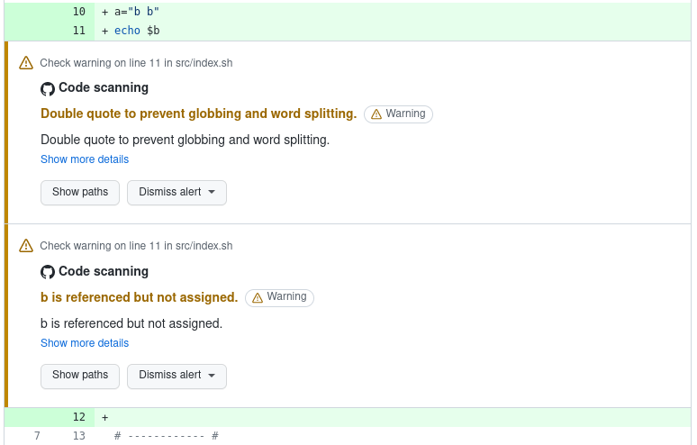
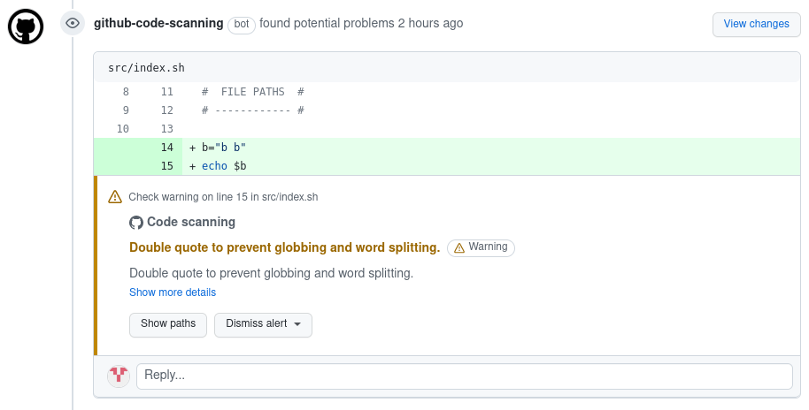

<!-- markdownlint-disable MD033 MD041 -->
<p align="center">
  
  <h1 align="center">Differential ShellCheck</h1>
</p>

[](https://github.com/marketplace/actions/differential-shellcheck) [](https://github.com/redhat-plumbers-in-action/differential-shellcheck/actions/workflows/shellcheck-test.yml) [![Mergify Status][mergify-status]][mergify]

[mergify]: https://mergify.com
[mergify-status]: https://img.shields.io/endpoint.svg?url=https://api.mergify.com/v1/badges/redhat-plumbers-in-action/differential-shellcheck&style=flat

This repository hosts code for running differential ShellCheck in GitHub actions. Idea of having something like differential ShellCheck was first introduced in [@fedora-sysv/initscripts](https://github.com/fedora-sysv/initscripts). Initscripts needed some way to verify incoming PR's without getting warnings and errors about already merged and for years working code. Therefore, differential ShellCheck was born.

## How does it work

First Differential ShellCheck gets a list of changed shell scripts based on file extensions, shebangs and script list, if provided. Then it calls [@koalaman/shellcheck](https://github.com/koalaman/shellcheck) on those scripts where it stores ShellCheck output for later use. Then it switches from `HEAD` to provided `BASE` and runs ShellCheck on the same files as before and stores output to separate file.

To evaluate results Differential ShellCheck uses utilities `csdiff` and `csgrep` from [@csutils/csdiff](https://github.com/csutils/csdiff). First is used `csdiff` to get a list/number of fixed and added errors. And then is used `csgrep` to output results in a nice colorized way to console and optionally into GitHub GUI as security alert.

## Features

* Shell scripts auto-detection based on shebangs (`!#/bin/sh` or `!#/bin/bash`) and file extensions (`.sh`, `.bash`)
* Ability to white list specific error codes
* Statistics about fixed and added errors
* Colored console output with emojis
* [SARIF support](https://docs.github.com/en/code-security/code-scanning/integrating-with-code-scanning/sarif-support-for-code-scanning) - warnings are visible in `Changed files` tab of Pull-Request
* Ability to run in verbose mode when run with [debug option](https://github.blog/changelog/2022-05-24-github-actions-re-run-jobs-with-debug-logging/)
* Results displayed as [job summaries](https://github.blog/2022-05-09-supercharging-github-actions-with-job-summaries/)

## Usage

Example of running Differential ShellCheck:

```yml
name: Differential ShellCheck
on:
  pull_request:
    branches: [main]

permissions:
  contents: read

jobs:
  test:
    runs-on: ubuntu-20.04

    permissions:
      security-events: write

    steps: 
      - name: Repository checkout
        uses: actions/checkout@v3
        with:
          fetch-depth: 0

      - name: Differential ShellCheck
        uses: redhat-plumbers-in-action/differential-shellcheck@v2
        with:
          token: ${{ secrets.GITHUB_TOKEN }}
```

> **Note**: _`fetch-depth: 0` is required in order to run `differential-shellcheck` successfully._

<details>
  <summary>Console output example</summary>
  
</details>

<details>
  <summary>Example of output in Changed files tab</summary>
  
</details>

<details>
  <summary>Example of @github-code-scanning bot review comment</summary>
  
</details>

## Configuration options

Action currently accept following options:

```yml
# ...

- name: Differential ShellCheck
  uses: redhat-plumbers-in-action/differential-shellcheck@v2
  with:
    base: <base-sha>
    head: <head-sha>
    ignored-codes: <path to file with list of codes>
    shell-scripts: <path to file with list of scripts>
    token: <GitHub token>

# ...
```

### base

`SHA` of commit which will be used as base when performing differential ShellCheck.

* default value: `github.event.pull_request.base.sha`
* requirements: `optional`

### head

`SHA` of commit which refers to `HEAD`.

* default value: `github.event.pull_request.head.sha`
* requirements: `optional`

### ignored-codes

Path to text file which holds a list of ShellCheck codes which should be excluded from validation.

* default value: `undefined`
* requirements: `optional`
* example: [.diff-shellcheck-exceptions.txt](.github/.diff-shellcheck-exceptions.txt)

### shell-scripts

Path to text file which holds a list of shell scripts in this repository which would not for some reason picked up by shell script auto-detection routine.

* default value: `undefined`
* requirements: `optional`
* example: [.diff-shellcheck-scripts.txt](.github/.diff-shellcheck-scripts.txt)

> **Note**: _Every path should be absolute and placed on separate lines. Avoid spaces in list since they are counted as comment._

### token

Token used to upload findings in SARIF format to GitHub

* default value: `undefined`
* requirements: `optional`

Token needs to have following [characteristics](https://docs.github.com/en/rest/code-scanning#upload-an-analysis-as-sarif-data):

* Token with the `security_events` scope to use this endpoint for private repositories.
* Token with the `public_repo` scope for **public repositories only**.

## Limitations

* Currently `differential-shellcheck` action could be run only on Pull-Requests
