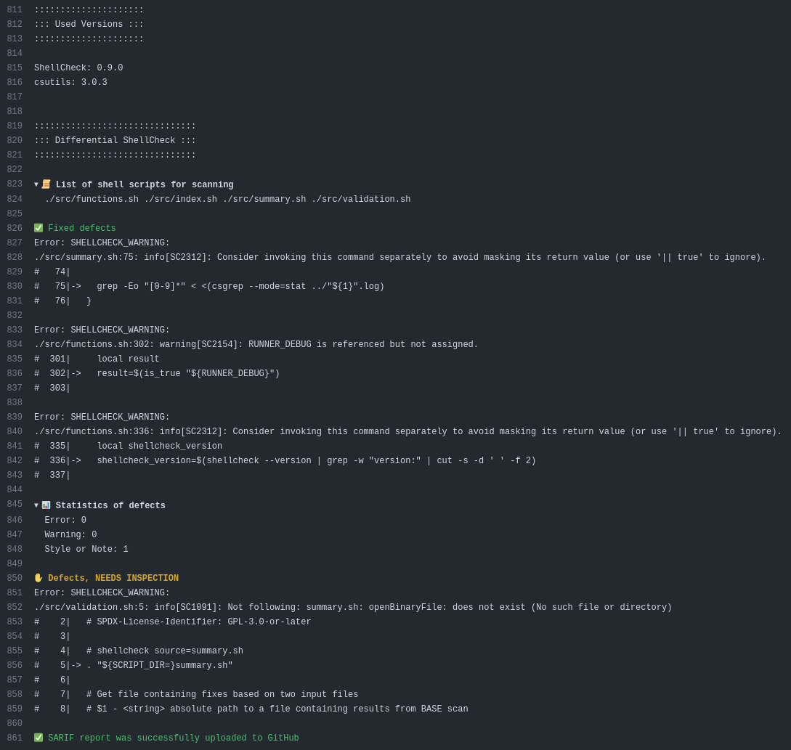
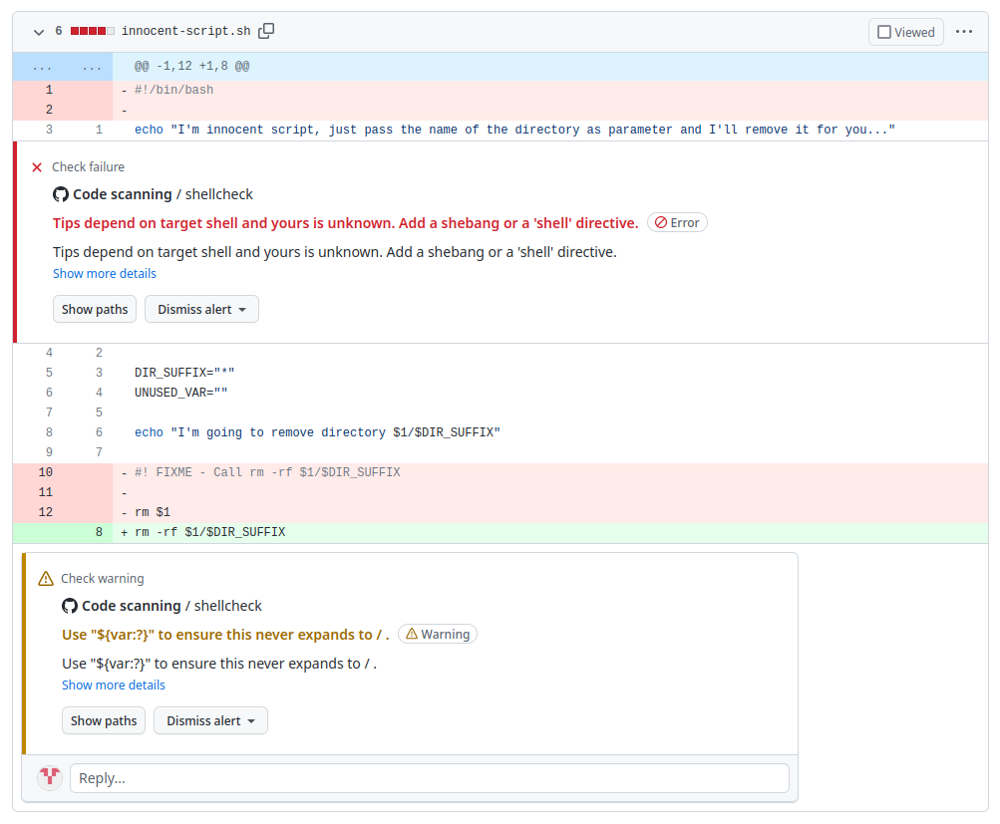
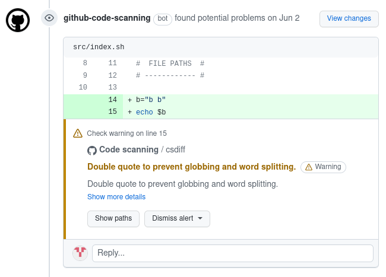

<!-- markdownlint-disable MD033 MD041 -->
<p align="center">
  
  <h1 align="center">Differential ShellCheck</h1>
</p>

[![GitHub Marketplace][market-status]][market] [![Lint Code Base][linter-status]][linter] [![Unit Tests][test-status]][test]

![OSSF-Scorecard Score][scorecard-status] [![OpenSSF Best Practices][best-practices-status]][best-practices] [![codecov][codecov-status]][codecov]  [![Mergify Status][mergify-status]][mergify]

<!-- Status links -->

[market]: https://github.com/marketplace/actions/differential-shellcheck
[market-status]: https://img.shields.io/badge/Marketplace-Differential%20Shellcheck-blue.svg?colorA=24292e&colorB=0366d6&style=flat&longCache=true&logo=data:image/png;base64,iVBORw0KGgoAAAANSUhEUgAAAA4AAAAOCAYAAAAfSC3RAAAABHNCSVQICAgIfAhkiAAAAAlwSFlzAAAM6wAADOsB5dZE0gAAABl0RVh0U29mdHdhcmUAd3d3Lmlua3NjYXBlLm9yZ5vuPBoAAAERSURBVCiRhZG/SsMxFEZPfsVJ61jbxaF0cRQRcRJ9hlYn30IHN/+9iquDCOIsblIrOjqKgy5aKoJQj4O3EEtbPwhJbr6Te28CmdSKeqzeqr0YbfVIrTBKakvtOl5dtTkK+v4HfA9PEyBFCY9AGVgCBLaBp1jPAyfAJ/AAdIEG0dNAiyP7+K1qIfMdonZic6+WJoBJvQlvuwDqcXadUuqPA1NKAlexbRTAIMvMOCjTbMwl1LtI/6KWJ5Q6rT6Ht1MA58AX8Apcqqt5r2qhrgAXQC3CZ6i1+KMd9TRu3MvA3aH/fFPnBodb6oe6HM8+lYHrGdRXW8M9bMZtPXUji69lmf5Cmamq7quNLFZXD9Rq7v0Bpc1o/tp0fisAAAAASUVORK5CYII=

[linter]: https://github.com/redhat-plumbers-in-action/differential-shellcheck/actions/workflows/linter.yml
[linter-status]: https://github.com/redhat-plumbers-in-action/differential-shellcheck/actions/workflows/linter.yml/badge.svg

[test]: https://github.com/redhat-plumbers-in-action/differential-shellcheck/actions/workflows/unit-test.yml
[test-status]: https://github.com/redhat-plumbers-in-action/differential-shellcheck/actions/workflows/unit-test.yml/badge.svg

[codecov]: https://codecov.io/gh/redhat-plumbers-in-action/differential-shellcheck
[codecov-status]: https://codecov.io/gh/redhat-plumbers-in-action/differential-shellcheck/branch/main/graph/badge.svg?token=9E9K03DRX5

[scorecard-status]: https://img.shields.io/ossf-scorecard/github.com/redhat-plumbers-in-action/differential-shellcheck?label=OSSF-Scorecard%20Score

[best-practices]: https://bestpractices.coreinfrastructure.org/projects/6540
[best-practices-status]: https://bestpractices.coreinfrastructure.org/projects/6540/badge

[mergify]: https://mergify.com
[mergify-status]: https://img.shields.io/endpoint.svg?url=https://api.mergify.com/v1/badges/redhat-plumbers-in-action/differential-shellcheck&style=flat

<!-- -->

This repository hosts code for running Differential ShellCheck in GitHub Actions. Idea of having something like a Differential ShellCheck was first introduced in [@fedora-sysv/initscripts](https://github.com/fedora-sysv/initscripts). Initscripts needed some way to verify incoming Pull Requests without getting warnings and errors about already merged and for years working code. Therefore, Differential ShellCheck was born.

## How does it work

First Differential ShellCheck gets a list of changed shell scripts based on file extensions, shebangs and script list, if provided. Then it calls [@koalaman/shellcheck](https://github.com/koalaman/shellcheck) on those scripts where it stores ShellCheck output for later use. Then it switches from `HEAD` to provided `BASE` and runs ShellCheck on the same files as before and stores output to a separate file.

To evaluate results, Differential ShellCheck uses utilities `csdiff` and `csgrep` from [@csutils/csdiff](https://github.com/csutils/csdiff). First `csdiff` is used to get a list/number of fixed and added errors. And then `csgrep` is used to output the results in a nice colorized way to console and optionally into GitHub GUI as a security alert.

## Features

* Shell scripts auto-detection based on shebangs, ShellCheck directives, file extensions and more
  * supported shell interpreters are: `sh`, `ash`, `bash`, `dash`, `ksh` and `bats`
  * supported shebangs are: `#!/bin/`, `#!/usr/bin/`, `#!/usr/local/bin/`, `#!/bin/env␣`, `#!/usr/bin/env␣` and `#!/usr/local/bin/env␣` ; e.g. `#!/bin/env␣bash`
  * support for ShellCheck directives ; e.g. `# shellcheck shell=bash`
  * support for [`emacs` modes specifications](https://www.gnu.org/software/emacs/manual/html_node/emacs/Choosing-Modes.html) ; e.g. `# -*- sh -*-`
  * support for [`vi/vim` modeline specifications](http://vimdoc.sourceforge.net/htmldoc/options.html#modeline) ; e.g. `# vi: set filetype=sh`, `# vim: ft=sh`
* Ability to allowlist specific error codes
* Statistics about fixed and added errors
* Colored console output with emojis
* [SARIF support](https://docs.github.com/en/code-security/code-scanning/integrating-with-code-scanning/sarif-support-for-code-scanning) - warnings are visible in the `Changed files` tab of the Pull-Request and as [comment alerts on Pull-Requests](https://github.blog/changelog/2022-06-02-users-can-view-and-comment-on-code-scanning-alerts-on-the-conversation-tab-in-a-pull-request/)
* Ability to run in a verbose mode when run with [debug option](https://github.blog/changelog/2022-05-24-github-actions-re-run-jobs-with-debug-logging/)
* Results displayed as [job summaries](https://github.blog/2022-05-09-supercharging-github-actions-with-job-summaries/)
* Ability to configure Differential ShellCheck using [`.shellcheckrc`](https://github.com/koalaman/shellcheck/blob/master/shellcheck.1.md#rc-files)

## Usage

Example of running Differential ShellCheck:

```yml
name: Differential ShellCheck
on:
  push:
    branches: [ main ]
  pull_request:
    branches: [ main ]

permissions:
  contents: read

jobs:
  lint:
    runs-on: ubuntu-latest
    
    permissions:
      # required for all workflows
      security-events: write

      # only required for workflows in private repositories
      actions: read
      contents: read

    steps:
      - name: Repository checkout
        uses: actions/checkout@v3
        with:
          fetch-depth: 0

      - id: ShellCheck
        name: Differential ShellCheck
        uses: redhat-plumbers-in-action/differential-shellcheck@v4
        with:
          token: ${{ secrets.GITHUB_TOKEN }}

      - if: ${{ always() }}
        name: Upload artifact with ShellCheck defects in SARIF format
        uses: actions/upload-artifact@v3
        with:
          name: Differential ShellCheck SARIF
          path: ${{ steps.ShellCheck.outputs.sarif }}
```

> **Warning**: _`fetch-depth: 0` is required to run `differential-shellcheck` successfully. It fetches all git history._

<details>
  <summary>Console output example</summary>
  <p align="center">
    
  </p>
</details>

<details>
  <summary>Example of output in Changed files tab</summary>
  <p align="center">
    <picture>
      <source media="(prefers-color-scheme: dark)" srcset="docs/images/sarif-output-example-dark.png">
      
    </picture>
  </p>
</details>

<details>
  <summary>Example of @github-code-scanning bot review comment</summary>
  <p align="center">
    <picture>
      <source media="(prefers-color-scheme: dark)" srcset="docs/images/sarif-comment-dark.png">
      
    </picture>
  </p>
</details>

### Real life examples of usage

* [`rbenv/rbenv`](https://sourcegraph.com/search?q=context:global+repo:%5Egithub%5C.com/rbenv/rbenv%24+file:%5E%5C.github/workflows+redhat-plumbers-in-action/differential-shellcheck&patternType=literal) [](https://github.com/rbenv/rbenv)

* [`systemd/systemd`](https://sourcegraph.com/search?q=context:global+repo:%5Egithub%5C.com/systemd/systemd%24+file:%5E%5C.github/workflows+redhat-plumbers-in-action/differential-shellcheck&patternType=literal) [](https://github.com/systemd/systemd)

* [`cockpit-project/cockpit`](https://sourcegraph.com/search?q=context:global+repo:%5Egithub%5C.com/cockpit-project/cockpit%24+file:%5E%5C.github/workflows+redhat-plumbers-in-action/differential-shellcheck&patternType=literal) [](https://github.com/cockpit-project/cockpit)

* [`89luca89/distrobox`](https://sourcegraph.com/search?q=context:global+repo:%5Egithub%5C.com/89luca89/distrobox%24+file:%5E%5C.github/workflows+redhat-plumbers-in-action/differential-shellcheck&patternType=literal) [](https://github.com/89luca89/distrobox)

* [`flatpak/flatpak`](https://sourcegraph.com/search?q=context:global+repo:%5Egithub%5C.com/flatpak/flatpak%24+file:%5E%5C.github/workflows+redhat-plumbers-in-action/differential-shellcheck&patternType=literal) [](https://github.com/flatpak/flatpak)

* more examples - [here](https://github.com/redhat-plumbers-in-action/differential-shellcheck/network/dependents?package_id=UGFja2FnZS0yOTkzNjMxNzI2)

## Configuration options

Action currently accepts following options:

```yml
# ...

- name: Differential ShellCheck
  uses: redhat-plumbers-in-action/differential-shellcheck@v4
  with:
    triggering-event: <name of triggering event>
    base: <sha1>
    head: <sha1>
    pull-request-base: <sha1>
    pull-request-head: <sha1>
    push-event-base: <sha1>
    push-event-head: <sha1>
    diff-scan: <true or false>
    strict-check-on-push: <true or false>
    ignored-codes: <path to file with list of codes>    # <-- Deprecated option
    shell-scripts: <path to file with list of scripts>
    external-sources: <true or false>
    severity: <minimal severity level>
    exclude-path: <list of paths>
    token: <GitHub token>

# ...
```

### triggering-event

The name of the event that triggered the workflow run. Supported values are: `pull_request`, `push` and `manual`.

* default value: `${{ github.event_name }}`
* requirements: `optional`

### base

`SHA1` of the commit which will be used as the base when performing differential ShellCheck. Input is used only when `triggering-event` is set to `manual`.

* default value: `undefined`
* requirements: `optional`

### head

`SHA1` of the commit which refers to the `HEAD` of changes. Input is used only when `triggering-event` is set to `manual`.

* default value: `undefined`
* requirements: `optional`

### pull-request-base

`SHA1` of the top commit on the base branch. Input is used when `triggering-event` is set to `pull_request`.

* default value: `${{ github.event.pull_request.base.sha }}`
* requirements: `optional`

### pull-request-head

`SHA1` of the latest commit in Pull Request. Input is used when `triggering-event` is set to `pull_request`.

* default value: `${{ github.event.pull_request.head.sha }}`
* requirements: `optional`

### push-event-base

`SHA1` of the last commit before the push. Input is used when `triggering-event` is set to `push`.

* default value: `${{ github.event.before }}`
* requirements: `optional`

### push-event-head

`SHA1` of the last commit after push. Input is used when `triggering-event` is set to `push`.

* default value: `${{ github.event.after }}`
* requirements: `optional`

### diff-scan

Input allows requesting a specific type of scan. Input is considered only if `triggering-event` is set to `manual`.

Default types of scans based on `triggering-event` input:

| `triggering-event` | type of scan               |
|--------------------|----------------------------|
| `pull_request`     | differential               |
| `push`             | full                       |
| `manual`           | based on `diff-scan` input |

* default value: `true`
* requirements: `optional`

### strict-check-on-push

Differential ShellCheck performs full scans when running on a `push` event, but the Action fails only when new defects are added. This option allows overwriting this behavior. Hence when `strict-check-on-push` is set to `true` it will fail when any defect is discovered.

* default value: `false`
* requirements: `optional`

### ignored-codes

Path to a text file which holds a list of ShellCheck codes which should be excluded from validation.

* default value: `undefined`
* requirements: `optional`

> **Warning**: _This option is now deprecated, please consider using `.shellcheckrc` instead._

### shell-scripts

Path to a text file which holds a list of shell scripts which would not, otherwise, be automatically picked by the shell script auto-detection routine.

* default value: `undefined`
* requirements: `optional`
* example: [.differential-shellcheck-scripts.txt](.github/.differential-shellcheck-scripts.txt)

> **Warning**: _Every path should be absolute and placed on a separate line. Avoid spaces in the list since they are interpreted as comments._

### external-sources

Enable following of source statements even when the file is not specified as input. By default, [ShellCheck](https://github.com/koalaman/shellcheck/blob/master/shellcheck.1.md) will only follow files specified on the command-line (plus `/dev/null`). This option allows following any file the script may source. This option may also be enabled using `external-sources=true` in `.shellcheckrc`.

* default value: `true`
* requirements: `optional`

### severity

Minimal severity level of detected errors that will be reported. Valid values in order of severity are `error`, `warning`, `info` and `style`.

* default value: `style`
* requirements: `optional`

### exclude-path

List of relative paths excluded from ShellCheck scanning. Globbing is supported.

* requirements: `optional`
* example: `"test/{bats,beakerlib}/**"`

### token

Token used to upload findings in SARIF format to GitHub.

* default value: `undefined`
* requirements: `optional`

Token needs to have the following [characteristics](https://docs.github.com/en/rest/code-scanning#upload-an-analysis-as-sarif-data):

* Token with the `security_events: write` scope to use this endpoint for private repositories.
* Token with the `public_repo` scope for **public repositories only**.

If the `token` isn't passed, SARIF file can be uploaded manually using [sarif from outputs](#sarif) and [github/codeql-action/upload-sarif](https://docs.github.com/en/code-security/code-scanning/integrating-with-code-scanning/uploading-a-sarif-file-to-github#uploading-a-code-scanning-analysis-with-github-actions) GitHub Action.

## Outputs

Differential ShellCheck exposes following [outputs](https://docs.github.com/en/actions/using-jobs/defining-outputs-for-jobs).

### sarif

Relative path to SARIF file containing detected defects. Example of use:

```yaml
- id: ShellCheck
  name: Differential ShellCheck
  uses: redhat-plumbers-in-action/differential-shellcheck@v4

- if: ${{ always() }}
  name: Upload artifact with ShellCheck defects in SARIF format
  uses: actions/upload-artifact@v3
  with:
    name: Differential ShellCheck SARIF
    path: ${{ steps.ShellCheck.outputs.sarif }}

- if: ${{ always() }}
  name: Upload SARIF to GitHub using github/codeql-action/upload-sarif
  uses: github/codeql-action/upload-sarif@v2
  with:
    sarif_file: ${{ steps.ShellCheck.outputs.sarif }}
```

## Using with Private repositories

Differential ShellCheck GitHub Action could be used in private repositories by any user. But code scanning-related features are available only for GitHub Enterprise users, as mentioned in [GitHub Documentation](https://docs.github.com/en/code-security/code-scanning/automatically-scanning-your-code-for-vulnerabilities-and-errors/about-code-scanning):

_Code scanning is available for all public repositories on GitHub.com. Code scanning is also available for private repositories owned by organizations that use GitHub Enterprise Cloud and have a license for GitHub Advanced Security. For more information, see "[About GitHub Advanced Security](https://docs.github.com/en/get-started/learning-about-github/about-github-advanced-security)"._

## Limitations

* `differential-shellcheck` Action doesn't run correctly when overwriting commits using `--force` and when the triggering event is `push`.

---

Useful documents: _[CHANGELOG](docs/CHANGELOG.md)_ | _[ARCHITECTURE](docs/ARCHITECTURE.md)_ | _[CONTRIBUTING](docs/CONTRIBUTING.md)_ | _[CODE_OF_CONDUCT](docs/CODE_OF_CONDUCT.md)_ | _[SECURITY](docs/SECURITY.md)_ | _[LICENSE](LICENSE)_
